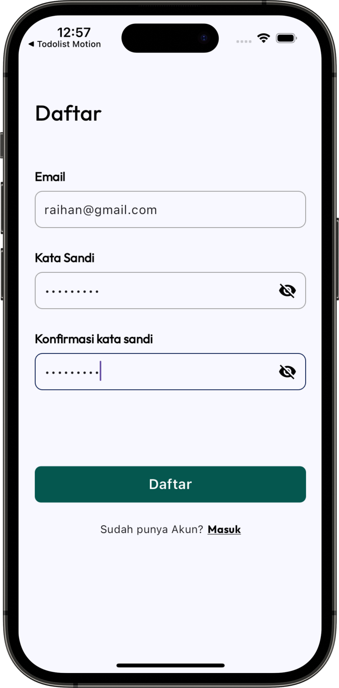
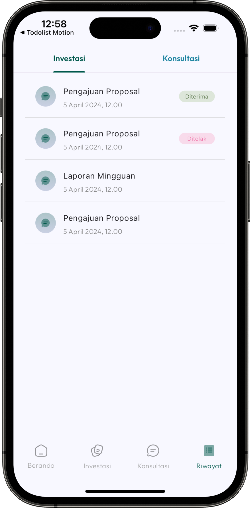

# GrowFundU

GrowFundU adalah sebuah platform yang menawarkan layanan konsultasi profesional bagi UMKM dan memfasilitasi dalam pencarian investor. Aplikasi ini bertujuan untuk memudahkan proses mendapatkan solusi untuk berbagai tahapan yang dihadapi, termasuk kesulitan dalam menemukan investor dan mengatasi permasalahan internal dalam usaha.

## Installation

Clone project ini

```bash
https://github.com/raihansyahrin/team_5_motionhack.git
```

Get dependency

```bash
flutter pub get
```

Run project

```bash
flutter run
```

Demo account

```bash
Email : dummy email
Password : dummy password
```

## Screenshots

<div align="center">
  
  
</div>

<div align="center">
  
  
</div>

<div align="center">
  
</div>
